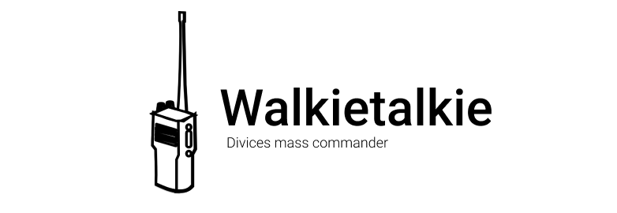

<p align="center">
    
</p>

<p align="center">
    
</p>

## What is Walkietalkie?
Walkietalkie is an application to help system admins to execute simple payloads in many remote devices at once.

It is a composition of a server (soldier) and a client (commander), what the server is set up and configured in the 
remote device and the client is who want to execute that payload.

### Soldier (server)
The Soldier is the Walkietalkie's server, and it is responsible to receive, execute and return the result from the 
payload.

The Soldier is configured by a file called `soldier.ron`.
```ron 
(
    name: "S. Buck", // It should be unique and it used to indefy the Soldier.
    addr: "127.0.0.1:14114", // It is the host what the Soldier listen.
    group: "root", // It is the unix group who will use the Soldier.
    user: "root", // It is the unix user who will use the Soldier.
    seal: ( // It defines credentials to acess the Soldier.
       username: "root",
       password: "root",
    )
)
```

### Commander (client)
Commander is the Walkietalkie's client, therefore it sends the commands to be executed in the Soldier (Server) and deal
with output.

```ron
(
  name: "Cpt. Steven Rogers", // It should be unique and it used to indefy the Commander.
  devices: [ // List of devices what the commander can connect and execute payloads.
    Device (
      address: "127.0.0.1:14114", // Device address.
      seal: Seal ( // It defines credentials to acess the Soldier.
        username: "root",
        password: "root"
      )
    ),
  ],
    commands: [ // List of commands to be executed in the devices.
        Command (
            name: "echo",
            args: [
                "Hello, world!"
            ]),
        Command (
            name: "curl",
            args: [
                "www.google.com"
            ])
    ],
)
```

> Note: Soldier and Commander is still not implemented, but there are examples inside examples' folder.

## How it works?

<p align="center">
    
</p>

### The Commander:

- Send the commands to Soldiers configured in `commander.ron` 
- Wait for a response
- Show the output

### The Soldier:
- Listening for Commander's connection 
- Authenticate
- Require commands
- Executes commands
- Send back the Responses
- Wait new commands

## How to use?

> Note: The CLI interface is still not implemented, but there are examples inside examples' folder.

The CLI interface is intend to be as simple as possible.

To start a soldier with the right `soldier.ron` configuration file:
```sh
walkietalkie soldier
```

To send a commands from a Commander to all Soldiers configured in `commander.ron` file:
```sh
walkietalkie commander
```
